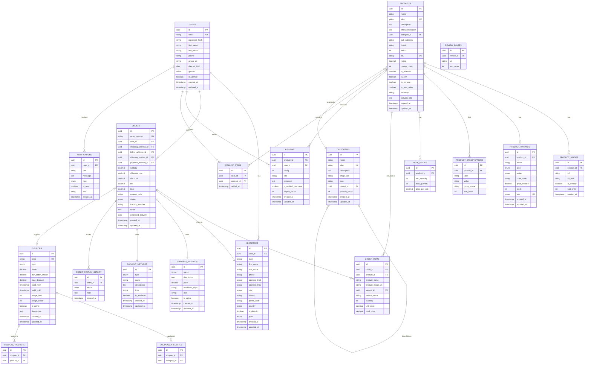

# Database Schema Documentation

## Overview

This document describes the database schema for the VGO e-commerce platform. The schema is designed to support a full-featured online marketplace with products, users, orders, reviews, and more.

## Entity Relationship Diagram



## Table Schemas

### Users Table

Stores user account information.

| Column | Type | Constraints | Description |
|--------|------|-------------|-------------|
| id | UUID | PRIMARY KEY | Unique user identifier |
| email | VARCHAR(255) | UNIQUE, NOT NULL | User email address |
| password_hash | VARCHAR(255) | NOT NULL | Hashed password |
| first_name | VARCHAR(100) | NOT NULL | User's first name |
| last_name | VARCHAR(100) | NOT NULL | User's last name |
| phone | VARCHAR(20) | | Phone number |
| avatar_url | VARCHAR(500) | | Profile picture URL |
| date_of_birth | DATE | | Date of birth |
| gender | ENUM('male','female','other') | | Gender |
| is_verified | BOOLEAN | DEFAULT FALSE | Email verification status |
| created_at | TIMESTAMP | DEFAULT NOW() | Account creation timestamp |
| updated_at | TIMESTAMP | DEFAULT NOW() | Last update timestamp |

**Indexes:**
- `idx_users_email` on `email`
- `idx_users_created_at` on `created_at`

---

### Addresses Table

Stores shipping and billing addresses for users.

| Column | Type | Constraints | Description |
|--------|------|-------------|-------------|
| id | UUID | PRIMARY KEY | Unique address identifier |
| user_id | UUID | FOREIGN KEY → users(id) | Owner of the address |
| label | VARCHAR(50) | NOT NULL | Address label (e.g., "Home") |
| first_name | VARCHAR(100) | NOT NULL | Recipient first name |
| last_name | VARCHAR(100) | NOT NULL | Recipient last name |
| phone | VARCHAR(20) | NOT NULL | Contact phone number |
| address_line1 | VARCHAR(255) | NOT NULL | Primary address line |
| address_line2 | VARCHAR(255) | | Secondary address line |
| city | VARCHAR(100) | NOT NULL | City name |
| district | VARCHAR(100) | NOT NULL | District/province |
| postal_code | VARCHAR(20) | NOT NULL | Postal/ZIP code |
| country | VARCHAR(100) | NOT NULL | Country name |
| is_default | BOOLEAN | DEFAULT FALSE | Default address flag |
| type | ENUM('home','office','other') | NOT NULL | Address type |
| created_at | TIMESTAMP | DEFAULT NOW() | Creation timestamp |
| updated_at | TIMESTAMP | DEFAULT NOW() | Last update timestamp |

**Indexes:**
- `idx_addresses_user_id` on `user_id`
- `idx_addresses_is_default` on `is_default`

---

### Categories Table

Hierarchical product categories.

| Column | Type | Constraints | Description |
|--------|------|-------------|-------------|
| id | UUID | PRIMARY KEY | Unique category identifier |
| name | VARCHAR(100) | NOT NULL | Category name |
| slug | VARCHAR(100) | UNIQUE, NOT NULL | URL-friendly slug |
| description | TEXT | | Category description |
| image_url | VARCHAR(500) | | Category image |
| icon | VARCHAR(50) | | Icon emoji or code |
| parent_id | UUID | FOREIGN KEY → categories(id) | Parent category (NULL for root) |
| product_count | INTEGER | DEFAULT 0 | Cached product count |
| created_at | TIMESTAMP | DEFAULT NOW() | Creation timestamp |
| updated_at | TIMESTAMP | DEFAULT NOW() | Last update timestamp |

**Indexes:**
- `idx_categories_slug` on `slug`
- `idx_categories_parent_id` on `parent_id`

---

### Products Table

Main product information.

| Column | Type | Constraints | Description |
|--------|------|-------------|-------------|
| id | UUID | PRIMARY KEY | Unique product identifier |
| name | VARCHAR(255) | NOT NULL | Product name |
| slug | VARCHAR(255) | UNIQUE, NOT NULL | URL-friendly slug |
| description | TEXT | NOT NULL | Full product description |
| short_description | TEXT | | Brief description |
| category_id | UUID | FOREIGN KEY → categories(id) | Product category |
| sub_category | VARCHAR(100) | | Sub-category slug |
| brand | VARCHAR(100) | | Brand name |
| stock | INTEGER | NOT NULL, DEFAULT 0 | Available stock quantity |
| sku | VARCHAR(100) | UNIQUE, NOT NULL | Stock keeping unit |
| rating | DECIMAL(3,2) | DEFAULT 0.00 | Average rating (0-5) |
| review_count | INTEGER | DEFAULT 0 | Number of reviews |
| is_featured | BOOLEAN | DEFAULT FALSE | Featured product flag |
| is_new | BOOLEAN | DEFAULT FALSE | New arrival flag |
| is_on_sale | BOOLEAN | DEFAULT FALSE | On sale flag |
| is_best_seller | BOOLEAN | DEFAULT FALSE | Best seller flag |
| warranty | VARCHAR(255) | | Warranty information |
| delivery_info | TEXT | | Delivery information |
| created_at | TIMESTAMP | DEFAULT NOW() | Creation timestamp |
| updated_at | TIMESTAMP | DEFAULT NOW() | Last update timestamp |

**Indexes:**
- `idx_products_slug` on `slug`
- `idx_products_category_id` on `category_id`
- `idx_products_brand` on `brand`
- `idx_products_is_featured` on `is_featured`
- `idx_products_created_at` on `created_at`

---

### Product Prices Table

Stores pricing information for products (separate table for price history support).

| Column | Type | Constraints | Description |
|--------|------|-------------|-------------|
| id | UUID | PRIMARY KEY | Unique price identifier |
| product_id | UUID | FOREIGN KEY → products(id) | Product reference |
| amount | DECIMAL(10,2) | NOT NULL | Current price |
| original_amount | DECIMAL(10,2) | | Original price (before discount) |
| currency | VARCHAR(10) | NOT NULL | Currency code (e.g., "LKR") |
| discount_percentage | INTEGER | | Discount percentage |
| is_active | BOOLEAN | DEFAULT TRUE | Active price flag |
| valid_from | TIMESTAMP | DEFAULT NOW() | Price valid from |
| valid_until | TIMESTAMP | | Price valid until |

**Indexes:**
- `idx_product_prices_product_id` on `product_id`
- `idx_product_prices_is_active` on `is_active`

---

### Product Images Table

Product image gallery.

| Column | Type | Constraints | Description |
|--------|------|-------------|-------------|
| id | UUID | PRIMARY KEY | Unique image identifier |
| product_id | UUID | FOREIGN KEY → products(id) | Product reference |
| url | VARCHAR(500) | NOT NULL | Image URL |
| alt_text | VARCHAR(255) | NOT NULL | Alt text for accessibility |
| is_primary | BOOLEAN | DEFAULT FALSE | Primary image flag |
| sort_order | INTEGER | DEFAULT 0 | Display order |
| created_at | TIMESTAMP | DEFAULT NOW() | Upload timestamp |

**Indexes:**
- `idx_product_images_product_id` on `product_id`
- `idx_product_images_is_primary` on `is_primary`

---

### Product Variants Table

Product variations (color, size, etc.).

| Column | Type | Constraints | Description |
|--------|------|-------------|-------------|
| id | UUID | PRIMARY KEY | Unique variant identifier |
| product_id | UUID | FOREIGN KEY → products(id) | Product reference |
| name | VARCHAR(100) | NOT NULL | Variant name |
| type | ENUM('color','size','storage','material','other') | NOT NULL | Variant type |
| value | VARCHAR(100) | NOT NULL | Variant value |
| color_code | VARCHAR(7) | | Hex color code (for color variants) |
| price_modifier | DECIMAL(10,2) | DEFAULT 0.00 | Price adjustment |
| stock | INTEGER | NOT NULL, DEFAULT 0 | Variant stock |
| sku | VARCHAR(100) | UNIQUE, NOT NULL | Variant SKU |
| created_at | TIMESTAMP | DEFAULT NOW() | Creation timestamp |
| updated_at | TIMESTAMP | DEFAULT NOW() | Last update timestamp |

**Indexes:**
- `idx_product_variants_product_id` on `product_id`
- `idx_product_variants_sku` on `sku`

---

### Product Specifications Table

Technical specifications and features.

| Column | Type | Constraints | Description |
|--------|------|-------------|-------------|
| id | UUID | PRIMARY KEY | Unique specification identifier |
| product_id | UUID | FOREIGN KEY → products(id) | Product reference |
| label | VARCHAR(100) | NOT NULL | Specification label |
| value | VARCHAR(255) | NOT NULL | Specification value |
| group_name | VARCHAR(100) | | Specification group |
| sort_order | INTEGER | DEFAULT 0 | Display order |

**Indexes:**
- `idx_product_specs_product_id` on `product_id`

---

### Bulk Prices Table

Volume-based pricing tiers.

| Column | Type | Constraints | Description |
|--------|------|-------------|-------------|
| id | UUID | PRIMARY KEY | Unique bulk price identifier |
| product_id | UUID | FOREIGN KEY → products(id) | Product reference |
| min_quantity | INTEGER | NOT NULL | Minimum quantity |
| max_quantity | INTEGER | | Maximum quantity (NULL for unlimited) |
| price_per_unit | DECIMAL(10,2) | NOT NULL | Price per unit at this tier |

**Indexes:**
- `idx_bulk_prices_product_id` on `product_id`

---

### Orders Table

Customer orders.

| Column | Type | Constraints | Description |
|--------|------|-------------|-------------|
| id | UUID | PRIMARY KEY | Unique order identifier |
| order_number | VARCHAR(50) | UNIQUE, NOT NULL | Human-readable order number |
| user_id | UUID | FOREIGN KEY → users(id) | Customer reference |
| shipping_address_id | UUID | FOREIGN KEY → addresses(id) | Shipping address |
| billing_address_id | UUID | FOREIGN KEY → addresses(id) | Billing address |
| shipping_method_id | UUID | FOREIGN KEY → shipping_methods(id) | Shipping method |
| payment_method_id | UUID | FOREIGN KEY → payment_methods(id) | Payment method |
| subtotal | DECIMAL(10,2) | NOT NULL | Order subtotal |
| shipping_cost | DECIMAL(10,2) | NOT NULL | Shipping cost |
| discount | DECIMAL(10,2) | DEFAULT 0.00 | Total discount |
| tax | DECIMAL(10,2) | DEFAULT 0.00 | Tax amount |
| total | DECIMAL(10,2) | NOT NULL | Order total |
| coupon_code | VARCHAR(50) | | Applied coupon code |
| status | ENUM('pending','confirmed','processing','shipped','out_for_delivery','delivered','cancelled','returned','refunded') | NOT NULL | Order status |
| tracking_number | VARCHAR(100) | | Shipment tracking number |
| notes | TEXT | | Order notes |
| estimated_delivery | DATE | | Estimated delivery date |
| created_at | TIMESTAMP | DEFAULT NOW() | Order creation timestamp |
| updated_at | TIMESTAMP | DEFAULT NOW() | Last update timestamp |

**Indexes:**
- `idx_orders_order_number` on `order_number`
- `idx_orders_user_id` on `user_id`
- `idx_orders_status` on `status`
- `idx_orders_created_at` on `created_at`

---

### Order Items Table

Products in an order.

| Column | Type | Constraints | Description |
|--------|------|-------------|-------------|
| id | UUID | PRIMARY KEY | Unique order item identifier |
| order_id | UUID | FOREIGN KEY → orders(id) | Order reference |
| product_id | UUID | FOREIGN KEY → products(id) | Product reference |
| product_name | VARCHAR(255) | NOT NULL | Product name (snapshot) |
| product_image_url | VARCHAR(500) | | Product image (snapshot) |
| variant_id | UUID | FOREIGN KEY → product_variants(id) | Variant reference |
| variant_name | VARCHAR(255) | | Variant name (snapshot) |
| quantity | INTEGER | NOT NULL | Quantity ordered |
| unit_price | DECIMAL(10,2) | NOT NULL | Price per unit (snapshot) |
| total_price | DECIMAL(10,2) | NOT NULL | Total item price |

**Indexes:**
- `idx_order_items_order_id` on `order_id`
- `idx_order_items_product_id` on `product_id`

---

### Order Status History Table

Tracks order status changes.

| Column | Type | Constraints | Description |
|--------|------|-------------|-------------|
| id | UUID | PRIMARY KEY | Unique history identifier |
| order_id | UUID | FOREIGN KEY → orders(id) | Order reference |
| status | ENUM('pending','confirmed','processing','shipped','out_for_delivery','delivered','cancelled','returned','refunded') | NOT NULL | Status value |
| note | TEXT | | Status change note |
| created_at | TIMESTAMP | DEFAULT NOW() | Status change timestamp |

**Indexes:**
- `idx_order_status_history_order_id` on `order_id`

---

### Shipping Methods Table

Available shipping options.

| Column | Type | Constraints | Description |
|--------|------|-------------|-------------|
| id | UUID | PRIMARY KEY | Unique shipping method identifier |
| name | VARCHAR(100) | NOT NULL | Method name |
| description | TEXT | | Method description |
| price | DECIMAL(10,2) | NOT NULL | Shipping price |
| estimated_days | VARCHAR(50) | NOT NULL | Estimated delivery time |
| icon | VARCHAR(50) | | Icon emoji or code |
| is_active | BOOLEAN | DEFAULT TRUE | Active status |
| created_at | TIMESTAMP | DEFAULT NOW() | Creation timestamp |
| updated_at | TIMESTAMP | DEFAULT NOW() | Last update timestamp |

---

### Payment Methods Table

Available payment options.

| Column | Type | Constraints | Description |
|--------|------|-------------|-------------|
| id | UUID | PRIMARY KEY | Unique payment method identifier |
| type | ENUM('card','cod','bank','wallet') | NOT NULL | Payment type |
| name | VARCHAR(100) | NOT NULL | Method name |
| description | TEXT | | Method description |
| icon | VARCHAR(50) | | Icon emoji or code |
| is_available | BOOLEAN | DEFAULT TRUE | Availability status |
| created_at | TIMESTAMP | DEFAULT NOW() | Creation timestamp |
| updated_at | TIMESTAMP | DEFAULT NOW() | Last update timestamp |

---

### Coupons Table

Discount coupons and promo codes.

| Column | Type | Constraints | Description |
|--------|------|-------------|-------------|
| id | UUID | PRIMARY KEY | Unique coupon identifier |
| code | VARCHAR(50) | UNIQUE, NOT NULL | Coupon code |
| type | ENUM('percentage','fixed') | NOT NULL | Discount type |
| value | DECIMAL(10,2) | NOT NULL | Discount value |
| min_order_amount | DECIMAL(10,2) | | Minimum order amount |
| max_discount | DECIMAL(10,2) | | Maximum discount amount |
| valid_from | TIMESTAMP | NOT NULL | Valid from timestamp |
| valid_until | TIMESTAMP | NOT NULL | Valid until timestamp |
| usage_limit | INTEGER | | Maximum usage count |
| usage_count | INTEGER | DEFAULT 0 | Current usage count |
| is_active | BOOLEAN | DEFAULT TRUE | Active status |
| description | TEXT | | Coupon description |
| created_at | TIMESTAMP | DEFAULT NOW() | Creation timestamp |
| updated_at | TIMESTAMP | DEFAULT NOW() | Last update timestamp |

**Indexes:**
- `idx_coupons_code` on `code`
- `idx_coupons_is_active` on `is_active`

---

### Coupon Categories Table

Categories applicable for a coupon.

| Column | Type | Constraints | Description |
|--------|------|-------------|-------------|
| id | UUID | PRIMARY KEY | Unique identifier |
| coupon_id | UUID | FOREIGN KEY → coupons(id) | Coupon reference |
| category_id | UUID | FOREIGN KEY → categories(id) | Category reference |

**Indexes:**
- `idx_coupon_categories_coupon_id` on `coupon_id`

---

### Coupon Products Table

Specific products applicable for a coupon.

| Column | Type | Constraints | Description |
|--------|------|-------------|-------------|
| id | UUID | PRIMARY KEY | Unique identifier |
| coupon_id | UUID | FOREIGN KEY → coupons(id) | Coupon reference |
| product_id | UUID | FOREIGN KEY → products(id) | Product reference |

**Indexes:**
- `idx_coupon_products_coupon_id` on `coupon_id`

---

### Reviews Table

Product reviews and ratings.

| Column | Type | Constraints | Description |
|--------|------|-------------|-------------|
| id | UUID | PRIMARY KEY | Unique review identifier |
| product_id | UUID | FOREIGN KEY → products(id) | Product reference |
| user_id | UUID | FOREIGN KEY → users(id) | Reviewer reference |
| rating | INTEGER | NOT NULL, CHECK (rating >= 1 AND rating <= 5) | Rating (1-5) |
| title | VARCHAR(255) | | Review title |
| comment | TEXT | NOT NULL | Review comment |
| is_verified_purchase | BOOLEAN | DEFAULT FALSE | Verified purchase flag |
| helpful_count | INTEGER | DEFAULT 0 | Helpful votes count |
| created_at | TIMESTAMP | DEFAULT NOW() | Review creation timestamp |
| updated_at | TIMESTAMP | DEFAULT NOW() | Last update timestamp |

**Indexes:**
- `idx_reviews_product_id` on `product_id`
- `idx_reviews_user_id` on `user_id`
- `idx_reviews_rating` on `rating`

---

### Review Images Table

Images attached to reviews.

| Column | Type | Constraints | Description |
|--------|------|-------------|-------------|
| id | UUID | PRIMARY KEY | Unique image identifier |
| review_id | UUID | FOREIGN KEY → reviews(id) | Review reference |
| url | VARCHAR(500) | NOT NULL | Image URL |
| sort_order | INTEGER | DEFAULT 0 | Display order |

**Indexes:**
- `idx_review_images_review_id` on `review_id`

---

### Wishlist Items Table

User wishlist/saved items.

| Column | Type | Constraints | Description |
|--------|------|-------------|-------------|
| id | UUID | PRIMARY KEY | Unique wishlist item identifier |
| user_id | UUID | FOREIGN KEY → users(id) | User reference |
| product_id | UUID | FOREIGN KEY → products(id) | Product reference |
| added_at | TIMESTAMP | DEFAULT NOW() | Added timestamp |

**Indexes:**
- `idx_wishlist_items_user_id` on `user_id`
- `idx_wishlist_items_product_id` on `product_id`
- `unique_user_product` UNIQUE on `(user_id, product_id)`

---

### Notifications Table

User notifications.

| Column | Type | Constraints | Description |
|--------|------|-------------|-------------|
| id | UUID | PRIMARY KEY | Unique notification identifier |
| user_id | UUID | FOREIGN KEY → users(id) | User reference |
| title | VARCHAR(255) | NOT NULL | Notification title |
| message | TEXT | NOT NULL | Notification message |
| type | ENUM('order','promo','system','wishlist') | NOT NULL | Notification type |
| is_read | BOOLEAN | DEFAULT FALSE | Read status |
| link | VARCHAR(500) | | Related link |
| created_at | TIMESTAMP | DEFAULT NOW() | Creation timestamp |

**Indexes:**
- `idx_notifications_user_id` on `user_id`
- `idx_notifications_is_read` on `is_read`

---

## Sample Queries

### Get Featured Products with Category

```sql
SELECT 
    p.*,
    c.name as category_name,
    c.slug as category_slug,
    pp.amount as price,
    pp.original_amount,
    pp.currency,
    pp.discount_percentage
FROM products p
JOIN categories c ON p.category_id = c.id
JOIN product_prices pp ON p.id = pp.product_id AND pp.is_active = TRUE
WHERE p.is_featured = TRUE
ORDER BY p.created_at DESC
LIMIT 10;
```

### Get Product with All Details

```sql
-- Product basic info with price
SELECT 
    p.*,
    c.name as category_name,
    pp.amount as price,
    pp.original_amount,
    pp.currency,
    pp.discount_percentage
FROM products p
JOIN categories c ON p.category_id = c.id
JOIN product_prices pp ON p.id = pp.product_id AND pp.is_active = TRUE
WHERE p.slug = 'iphone-15-pro-max-256gb';

-- Product images
SELECT * FROM product_images 
WHERE product_id = (SELECT id FROM products WHERE slug = 'iphone-15-pro-max-256gb')
ORDER BY is_primary DESC, sort_order ASC;

-- Product variants
SELECT * FROM product_variants 
WHERE product_id = (SELECT id FROM products WHERE slug = 'iphone-15-pro-max-256gb')
ORDER BY type, name;

-- Product specifications
SELECT * FROM product_specifications 
WHERE product_id = (SELECT id FROM products WHERE slug = 'iphone-15-pro-max-256gb')
ORDER BY group_name, sort_order;
```

### Get User Orders with Items

```sql
SELECT 
    o.*,
    a.address_line1,
    a.city,
    a.district,
    sm.name as shipping_method_name,
    pm.name as payment_method_name
FROM orders o
JOIN addresses a ON o.shipping_address_id = a.id
JOIN shipping_methods sm ON o.shipping_method_id = sm.id
JOIN payment_methods pm ON o.payment_method_id = pm.id
WHERE o.user_id = 'user-uuid'
ORDER BY o.created_at DESC;

-- Order items
SELECT 
    oi.*,
    p.slug as product_slug
FROM order_items oi
JOIN products p ON oi.product_id = p.id
WHERE oi.order_id = 'order-uuid';
```

### Validate Coupon

```sql
SELECT * FROM coupons
WHERE code = 'WELCOME10'
    AND is_active = TRUE
    AND valid_from <= NOW()
    AND valid_until >= NOW()
    AND (usage_limit IS NULL OR usage_count < usage_limit);
```

### Get Product Reviews with User Info

```sql
SELECT 
    r.*,
    u.first_name,
    u.last_name,
    u.avatar_url
FROM reviews r
JOIN users u ON r.user_id = u.id
WHERE r.product_id = 'product-uuid'
ORDER BY r.created_at DESC;
```

### Search Products

```sql
SELECT 
    p.*,
    c.name as category_name,
    pp.amount as price,
    pp.original_amount,
    pp.currency
FROM products p
JOIN categories c ON p.category_id = c.id
JOIN product_prices pp ON p.id = pp.product_id AND pp.is_active = TRUE
WHERE 
    (p.name ILIKE '%search_term%' OR p.description ILIKE '%search_term%')
    AND p.stock > 0
ORDER BY p.rating DESC, p.review_count DESC
LIMIT 20 OFFSET 0;
```

## Notes

- All `id` fields use UUID for better scalability and security
- Timestamps use UTC timezone
- Prices are stored in cents/smallest currency unit (multiply by 100)
- Soft deletes can be implemented by adding `deleted_at` columns
- Consider adding full-text search indexes for product search
- Product prices are in a separate table to support price history
- Order items store product snapshots to preserve historical data
